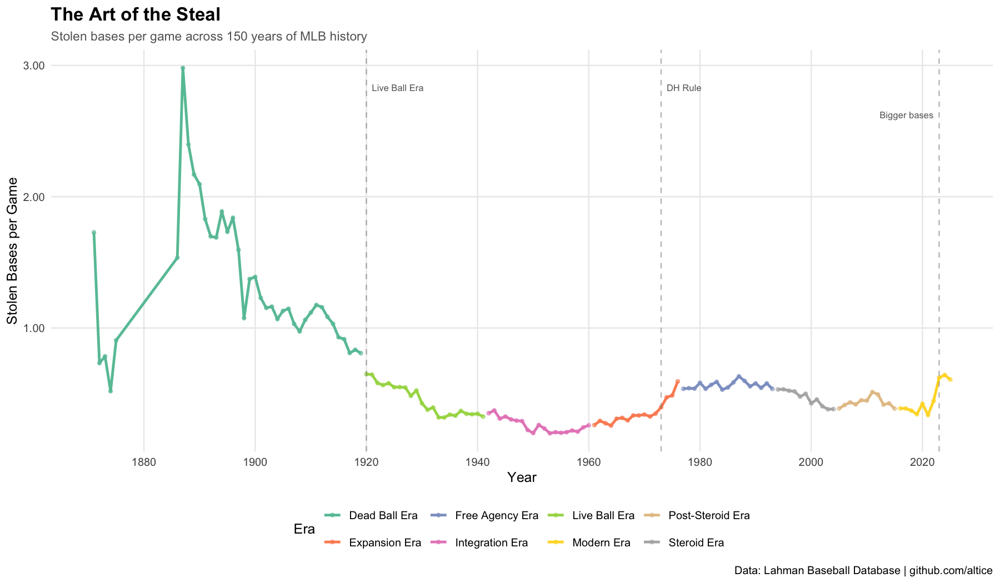

# The Art of the Steal

Stolen base trends across 150 years of MLB history, visualized in R using ggplot2 and dplyr.

**Key findings:**
- Stolen bases peaked at 3.0 per game in the Dead Ball Era (pre-1920)
- Declined sharply as the home run era took over
- The 2023 bigger bases rule produced the sharpest single-year spike in decades

**Tools:** R, ggplot2, dplyr, readr  
**Data:** Lahman Baseball Database (1871-2025)

